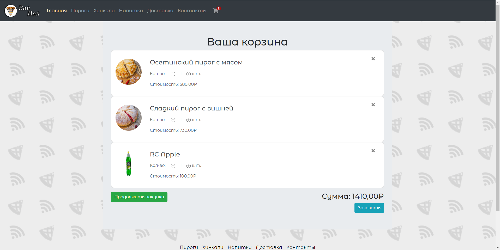

# Wi-Pie
MVC project using ASP.NET Core and EntityFramework Core.

## Prerequirements
* Visual Studio 2017 or higher
* .NET Core SDK
* SQL Server

## How To Run
* Open solution in Visual Studio
* Run the application.

## Screenshots

  
  
  
  
  
  
  

